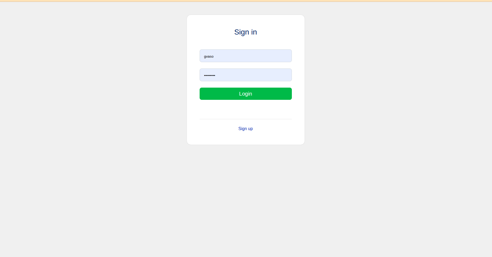
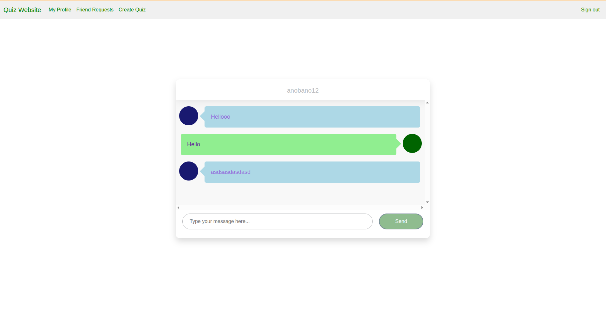
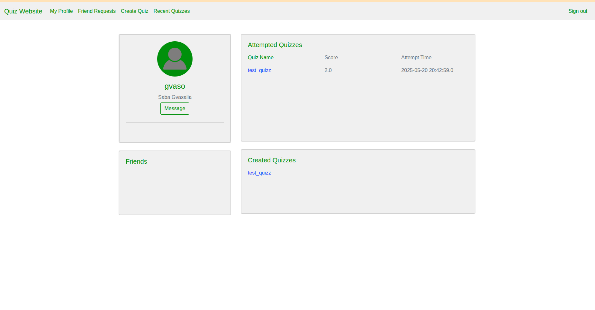
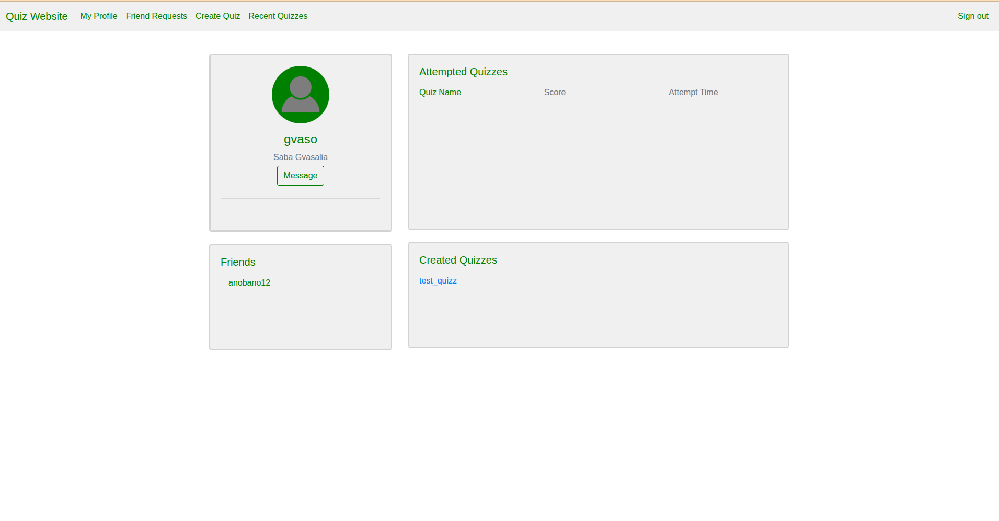
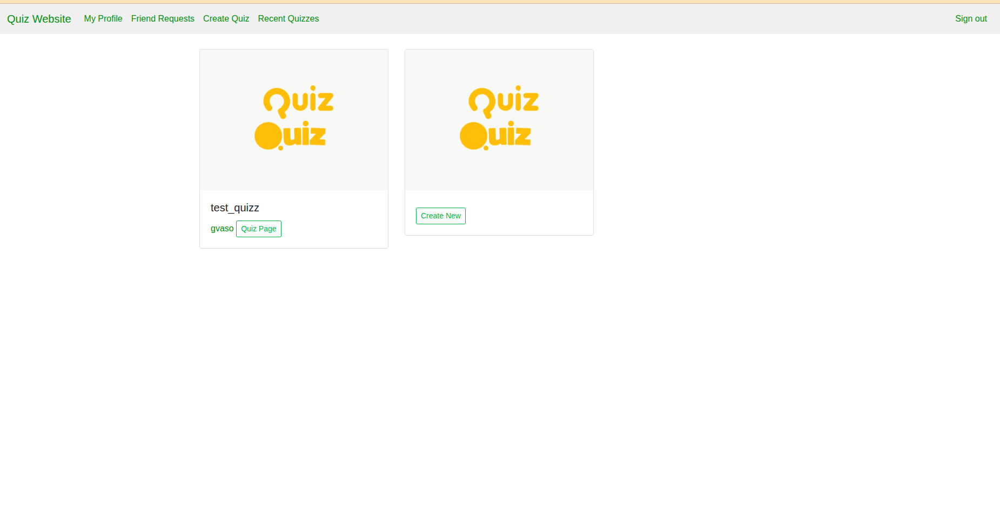
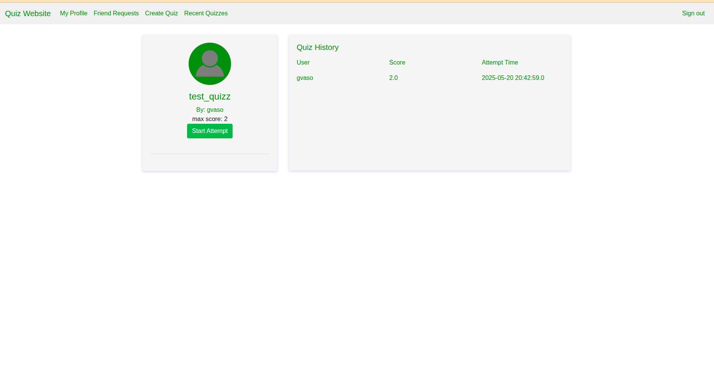

## Quizz Website

### Overview

An interactive quiz website developed as part of an Object-Oriented Programming course. The project showcases the application of Java principles in creating a user-friendly and dynamic application.

### Features

- **Interactive quizzes**: Customizable questions and answers.
- **Score tracking**: Keeps track of user progress.
- **Clean interface**: Simple, user-focused design.

### Technologies Used

- **Java**
- **JavaFX**
- **tomcat7**

### Installation


1. Clone the repository:
   ```bash
   git clone https://github.com/gvaso27/OOP-FINALPROJECT-quizzWebsite.git
   ```
2. Navigate to the project directory:
   ```bash
   cd OOP-FINALPROJECT-quizzWebsite
   ```
3. Run the application:
   ```bash
   mvn clean install
   mvn tomcat7:run
   ```

### Usage

- Follow the prompts to create and answer quizzes.
- View your scores in the results section.

### 📸 Screenshots

<p align="center">
  
  
</p>
<p align="center">
  
  
</p>
<p align="center">
  
  
</p>
<p align="center">
  
  
</p>

